<picture>
  <source media="(prefers-color-scheme: dark)" srcset="./dark.svg">
  <source media="(prefers-color-scheme: light)" srcset="./light.svg">
  
</picture>

<!-- Streak — full width -->
<picture>
  <source
    media="(prefers-color-scheme: dark)"
    srcset="https://streak-stats.demolab.com/?user=Sanjubhati1010&hide_border=true&background=0A101F&stroke=22D3EE&ring=A78BFA&fire=10B981&currStreakLabel=22D3EE&sideLabels=94A3B8&currStreakNum=F8FAFC&sideNums=F8FAFC&dates=64748B&titleColor=22D3EE&card_width=1180"
  />
  
</picture>

 

<!-- ===== GITHUB STATS + LANGUAGES ===== -->

  <picture>
    <source
      media="(prefers-color-scheme: dark)"
      srcset="https://github-readme-stats-two-phi-46.vercel.app/api?username=Sanjubhati1010&show_icons=true&count_private=true&include_all_commits=true&hide_rank=true&hide_border=true&line_height=20&title_color=22D3EE&icon_color=A78BFA&text_color=94A3B8&bg_color=0A101F&card_width=450"
    />
    
  </picture>
  <picture>
    <source
      media="(prefers-color-scheme: dark)"
      srcset="https://github-readme-stats-two-phi-46.vercel.app/api/top-langs/?username=Sanjubhati1010&layout=compact&langs_count=8&hide_border=true&title_color=22D3EE&text_color=94A3B8&bg_color=0A101F&card_width=450"
    />
    
  </picture>

<!-- Contribution Snake -->
<picture>
  <source
    media="(prefers-color-scheme: dark)"
    srcset="https://raw.githubusercontent.com/Sanjubhati1010/Sanjubhati1010/main/output/snake-dark.svg"
  />
  <source
    media="(prefers-color-scheme: light)"
    srcset="https://raw.githubusercontent.com/Sanjubhati1010/Sanjubhati1010/main/output/snake-light.svg"
  />
  
</picture>

<!-- ===== PROJECTS ===== -->

<!-- ===== SOCIAL BADGES ===== -->
 

&nbsp;&nbsp;

<!-- Instagram -->

&nbsp;&nbsp;

<!-- Email -->

<!-- LeetCode -->

